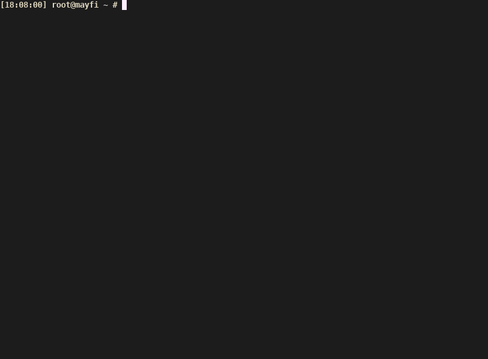

# 依赖审计日志，简化 SELinux 策略模块生成步骤

测试兼容 Gentoo Linux 和 CentOS 7

不兼容 CentOS 6，原因是其 `semodule -l` 和 `semanage module -l` 输出格式与新版均不同，隧简化了。

```
  Usage: ./buildSEModule.sh [OPTIONS] [MODULENAME]

    the default module name is "fixse<date><sequence>", e.g.: fixse2017081501

    -i <file>        audit log file
                     (default read all from audit, message and dmesg logs since last policy reload)
    -d <dir>         main directory of this script [dir] (default ./.selinux_module_gen_dir)
    -t <dir>         .te file directory (default [dir]/te)
    -m <dir>         .mod file directory (default [dir]/mod)
    -o <dir>         the generated .pp file directory (default [dir]/pp)
    -f               force to override existed files

    -h               print this help

```


