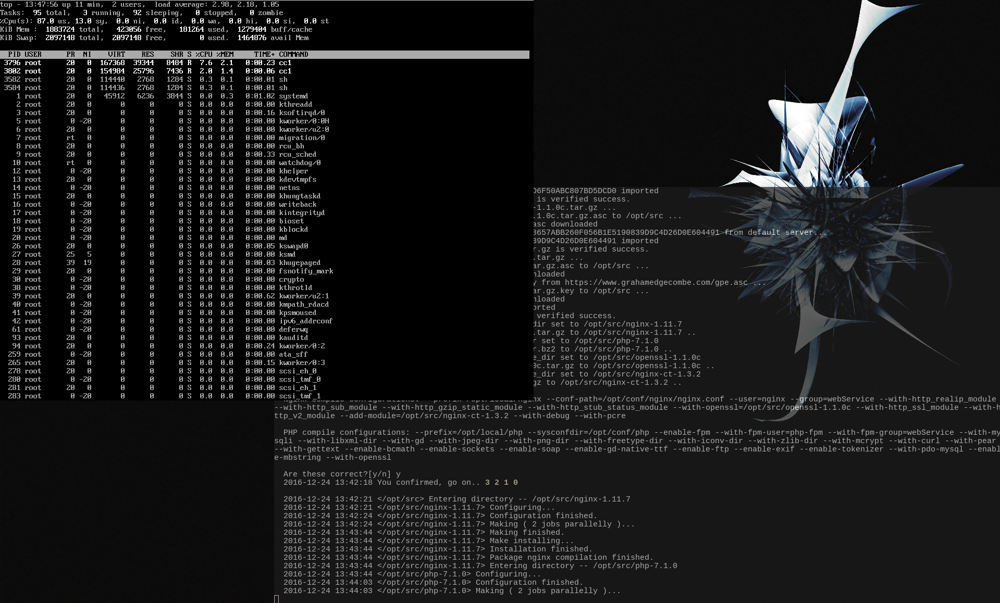

这是一个在 CentOS 7 上使用源码编译安装 Nginx 和 PHP-FPM 的脚本。同时会使用 yum 进行安装数据库 Mariadb （数据库的配置和安装完全不参考下列说明）

## 几点说明

相关变量简单说明，详细请查阅脚本内注释（以下说明的都可以通过修改对应脚本文件内变量进行修改）
+ Nginx 下默认单独指定 openssl 和 nginx-ct 编译进去的
+ 所有源码包都可以使用对应的 asc 文件验证其完整性，也是默认要求的。默认已经提供了如下：
  1. ML 版本 nginx-1.11.7 的下载连接和对应 asc 文件连接以及相关公钥信息
  2. LTS 版本 openssl-1.0.2j 的下载连接和对应 asc 文件连接以及相关公钥信息
  3. nginx-ct v1.3.2 的下载连接和对应 asc 文件连接以及相关公钥信息
  4. Stable 版本 PHP 7.1.0 的下载连接和对应 asc 文件连接以及相关公钥信息
+ 默认源码下载使用工具 wget 并指定目录 `/opt/src` ，同时也是解压路径和验证文件下载路径
+ 默认指定安装路径是 `/opt/local/<software_name>` ，配置文件路径是 `/opt/conf/<software_name>`
+ 默认 PID 文件路径 `/opt/run/<software_name>.pid`
+ 脚本执行过程，默认将脚本内命令执行 stdout 重定向到 `/dev/null` ，提供脚本运行参数 `-v` 可以指定，或者修改脚本内 debug 变量持久设置：
  1. 0：只显示脚本本身提示信息，所有内置命令的 stderr 和 stdout 都重定向到 `/dev/null` （最清爽的执行界面，最下方提供完整执行日志）
  2. 1：（默认值）stdout 重定向到 `/dev/null`
  3. 2：显示全部信息（这样子可能会很难发现关键性警告/错误提示）
+ 默认编译时候并行运行任务数目为当前机器逻辑 CPU 数目加一，可以使用参数指定修改或者修改脚本内 c_j 变量
+ 默认 Nginx 执行用户为 nginx ，用户组 webService
+ 默认 PHP-FPM 执行用户为 php-fpm ，用户组 webService
+ 可以设置下载文件时是否使用代理，默认无代理
+ 默认编译参数统一贴在下面，不用修改默认变量，有单独的变量 c_<softwarename>_compile_conf 可供设置：
  + 当设置参数不同时，会在默认参数情况下添加
  + 当设置参数键相同，值不同时，会覆盖默认参数
  + 当需要取消默认参数时，使用格式 `--parametername=!` ，不管该参数是否可以设置值，只需要设置感叹号即可取消该默认参数。


脚本执行最开始，会使用 yum 工具安装编译所需要的包：
> bzip2 gzip xz wget gcc make re2c autoconf pcre-devel zlib-devel libxml2-devel openssl-devel bzip2-devel libjpeg-devel libpng-devel gettext-devel freetype-devel libmcrypt-devel libcurl-devel bison-devel bison

全新安装模式下（下面有说明），编译结束后，默认生成 systemd 的服务文件，并配置好相关设置以及启用开机启动，直接运行 `systemctl start <software_name>` 即可运行程序（当然其他环境参数配置需要额外设置）

全新安装模式下，编译结束后，也同样会创建相应的用户和组，不创建用户文件夹， shell 设定为 `/usr/sbin/nologin`

## 脚本执行参数说明
```
  -h              显示帮助提示（英文的，为了避免字符串问题所有脚本内注释和提示都是英文）
  -e              安装模式一，情景是新机器安装时，将删除指定安装路径以及指定配置路径下对应的 PHP 和 Nginx 的文件 （默认的日志文件也在安装目录下，脚本内没有可以设置修改的项目）
  -r              安装模式二，情景是重新安装或者升级时，将删除指定安装路径下对应的 PHP 和 Nginx 的文件，不会删除配置文件
                  两个模式必须选择其一，否则无法继续执行
  -y              默认执行的时候会有几个步骤需要确认后方才可以执行，比如上述的删除动作，提供这个参数后，则不会有任何选择直接执行
  -j <jobs>       设定执行编译过程时同时运行任务数目，默认时当前 CPU 核心数 + 1 ，可以接受的参数值是 1-99
  -v <level>      日志在终端显示的详细程度，详细看上述已经有说明
  -n              不对下载的源码包进行签名认证，默认都是需要认证的，如果你比较懒找对应的签名文件下载连接和公钥信息，可以选择这个，不推荐
  -x <host:port>  下载时指定 HTTP 代理
  -s <dir>        除了可以在脚本内设置源码包下载路径，也可以在这里设置
  -d <dir>        除了可以在脚本内设置软件安装[基本的]路径，也可以在这里设置
  -c <dir>        除了可以在脚本内设置软件配置文件[基本的]路径，也可以在这里设置
                  在这里，[基本的]意思是非单独 Nginx 或者 PHP 的软件安装/配置路径，而是它们的总体路径，如许单独设置，脚本内提供了单独的自定义变量
                  比如：Nginx 的安装路径为 <当前设定的基本路径>/nginx
```

脚本执行结构还有太多的不足，准备写一个满足大多数源码包编译的脚本，在那里再改进吧

虽然我自行测试了好几遍，但脚本或许还是有一些 BUG ，不过大的错误不会有。尤其是在 rm 的时候。（仅有一处有 rm 的语句，并验证目录是否为 / ）

所以应该还是可以放心食用的。

## 默认编译参数
Nginx 的默认编译参数：

```
--prefix=/opt/local/nginx
--conf-path=opt/conf/nginx'/nginx.conf'
--user=nginx
--group=webService
--with-http_realip_module
--with-http_sub_module
--with-http_gzip_static_module
--with-http_stub_status_module
--with-openssl=$openssl_source_dir #这个变量会在解压 openssl 后自动设定
--with-http_ssl_module
--with-http_v2_module
--add-module=$ctnginx_source_dir #这个变量会在解压 nginx-ct 后自动设定
--with-debug
--with-pcre
```

PHP 的默认编译参数：
```
--prefix=/opt/local/php
--sysconfdir=/opt/conf/php
--enable-fpm
--with-fpm-user=php-fpm
--with-fpm-group=webService
--with-mysqli
--with-libxml-dir
--with-gd
--with-jpeg-dir
--with-png-dir
--with-freetype-dir
--with-iconv-dir
--with-zlib-dir
--with-mcrypt
--with-curl
--with-pear
--with-gettext
--enable-bcmath
--enable-sockets
--enable-soap
--enable-gd-native-ttf
--enable-ftp
--enable-exif
--enable-tokenizer
--with-pdo-mysql
--enable-mbstring
--with-openssl
```

## 一个完整的全新安装日志记录（-v 0 下）：

这是在我的本地计算机上一个全新的 CentOS 7 虚拟机上运行的日志输出，添加参数 -y 就不会有需要交互才能继续运行的情况了：

```
# ./nginxAndPhpInstall.sh -e -x 10.0.7.19:8123 -v 0

Here is the setting configurations, please confirm:
  New installation process.

  Use HTTP Proxy: 10.0.7.19:8123
  Source file workdir: /opt/src
  Installation dir: /opt/local
  Parallel jobs of make: 2
  Verbose mode: 0

  nginx_source: http://nginx.org/download/nginx-1.11.7.tar.gz
  nginx_source_asc: http://nginx.org/download/nginx-1.11.7.tar.gz.asc
  nginx_source_asc_public_key: http://nginx.org/keys/mdounin.key
  nginx_source_asc_public_key_id: B0F4253373F8F6F510D42178520A9993A1C052F8
  nginx_source_asc_public_key_uid: Maxim Dounin <mdounin@mdounin.ru>

  php_source: http://jp2.php.net/get/php-7.1.0.tar.bz2/from/this/mirror
  php_source_asc: http://jp2.php.net/get/php-7.1.0.tar.bz2.asc/from/this/mirror
  php_source_asc_public_key: 
  php_source_asc_public_key_id: A917B1ECDA84AEC2B568FED6F50ABC807BD5DCD0
  php_source_asc_public_key_uid: Davey Shafik <davey@php.net>

  openssl_source: https://www.openssl.org/source/openssl-1.1.0c.tar.gz
  openssl_source_asc: https://www.openssl.org/source/openssl-1.1.0c.tar.gz.asc
  openssl_source_asc_public_key: 
  openssl_source_asc_public_key_id: 8657ABB260F056B1E5190839D9C4D26D0E604491
  openssl_source_asc_public_key_uid: Matt Caswell <matt@openssl.org>

  ctnginx_source: https://github.com/grahamedgecombe/nginx-ct/archive/v1.3.2.tar.gz
  ctnginx_source_asc: https://github.com/grahamedgecombe/nginx-ct/releases/download/v1.3.2/v1.3.2.tar.gz.asc
  ctnginx_source_asc_public_key: https://www.grahamedgecombe.com/gpe.asc
  ctnginx_source_asc_public_key_id: D2B498F5C23753201BC7A020808A6AE4B9B44894
  ctnginx_source_asc_public_key_uid: 

  Packages installed by yum ( need epel-release ): bzip2 gzip xz wget gcc make re2c autoconf pcre-devel zlib-devel libxml2-devel openssl-devel bzip2-devel libjpeg-devel libpng-devel gettext-devel freetype-devel libmcrypt-devel libcurl-devel bison-devel bison mariadb mariadb-server

  Are these correct?[y/n] y
  2016-12-24 13:39:06 You confirmed, go on.. 3 2 1 0

  2016-12-24 13:39:09 </root> Install necessory packages by yum, please waiting.. 

  2016-12-24 13:40:46 </opt/src> -Downloading nginx-1.11.7.tar.gz to /opt/src ...
  2016-12-24 13:40:46 </opt/src> nginx-1.11.7.tar.gz downloaded
  2016-12-24 13:40:46 </opt/src> -Downloading php-7.1.0.tar.bz2 to /opt/src ...
  2016-12-24 13:40:46 </opt/src> php-7.1.0.tar.bz2 downloaded
  2016-12-24 13:40:46 </opt/src> -Downloading openssl-1.1.0c.tar.gz to /opt/src ...
  2016-12-24 13:40:55 </opt/src> openssl-1.1.0c.tar.gz downloaded
  2016-12-24 13:40:55 </opt/src> -Downloading ctnginx.tar.gz to /opt/src ...
  2016-12-24 13:40:57 </opt/src> ctnginx.tar.gz downloaded
  2016-12-24 13:40:57 </opt/src> Verifying file nginx-1.11.7.tar.gz ...
  2016-12-24 13:40:57 </opt/src> -Downloading nginx-1.11.7.tar.gz.asc to /opt/src ...
  2016-12-24 13:40:57 </opt/src> nginx-1.11.7.tar.gz.asc downloaded
  2016-12-24 13:40:57 </opt/src> -Downloading public key from http://nginx.org/keys/mdounin.key ...
  2016-12-24 13:40:57 </opt/src> -Downloading nginx-1.11.7.tar.gz.key to /opt/src ...
  2016-12-24 13:40:57 </opt/src> nginx-1.11.7.tar.gz.key downloaded
  2016-12-24 13:40:57 </opt/src> nginx-1.11.7.tar.gz.key imported
  2016-12-24 13:40:57 </opt/src> File nginx-1.11.7.tar.gz is verified success.
  2016-12-24 13:40:57 </opt/src> Verifying file php-7.1.0.tar.bz2 ...
  2016-12-24 13:40:57 </opt/src> -Downloading php-7.1.0.tar.bz2.asc to /opt/src ...
  2016-12-24 13:40:57 </opt/src> php-7.1.0.tar.bz2.asc downloaded
  2016-12-24 13:40:57 </opt/src> -Receiving public key A917B1ECDA84AEC2B568FED6F50ABC807BD5DCD0 from default server...
  2016-12-24 13:40:59 </opt/src> A917B1ECDA84AEC2B568FED6F50ABC807BD5DCD0 imported
  2016-12-24 13:40:59 </opt/src> File php-7.1.0.tar.bz2 is verified success.
  2016-12-24 13:40:59 </opt/src> Verifying file openssl-1.1.0c.tar.gz ...
  2016-12-24 13:40:59 </opt/src> -Downloading openssl-1.1.0c.tar.gz.asc to /opt/src ...
  2016-12-24 13:41:00 </opt/src> openssl-1.1.0c.tar.gz.asc downloaded
  2016-12-24 13:41:00 </opt/src> -Receiving public key 8657ABB260F056B1E5190839D9C4D26D0E604491 from default server...
  2016-12-24 13:41:00 </opt/src> 8657ABB260F056B1E5190839D9C4D26D0E604491 imported
  2016-12-24 13:41:01 </opt/src> File openssl-1.1.0c.tar.gz is verified success.
  2016-12-24 13:41:01 </opt/src> Verifying file ctnginx.tar.gz ...
  2016-12-24 13:41:01 </opt/src> -Downloading ctnginx.tar.gz.asc to /opt/src ...
  2016-12-24 13:41:03 </opt/src> ctnginx.tar.gz.asc downloaded
  2016-12-24 13:41:03 </opt/src> -Downloading public key from https://www.grahamedgecombe.com/gpe.asc ...
  2016-12-24 13:41:03 </opt/src> -Downloading ctnginx.tar.gz.key to /opt/src ...
  2016-12-24 13:41:06 </opt/src> ctnginx.tar.gz.key downloaded
  2016-12-24 13:41:06 </opt/src> ctnginx.tar.gz.key imported
  2016-12-24 13:41:06 </opt/src> File ctnginx.tar.gz is verified success.
  2016-12-24 13:41:06 </opt/src> variable nginx_source_dir set to /opt/src/nginx-1.11.7
  2016-12-24 13:41:06 </opt/src> unpacking nginx-1.11.7.tar.gz to /opt/src/nginx-1.11.7 ..
  2016-12-24 13:41:08 </opt/src> variable php_source_dir set to /opt/src/php-7.1.0
  2016-12-24 13:41:08 </opt/src> unpacking php-7.1.0.tar.bz2 to /opt/src/php-7.1.0 ..
  2016-12-24 13:41:12 </opt/src> variable openssl_source_dir set to /opt/src/openssl-1.1.0c
  2016-12-24 13:41:12 </opt/src> unpacking openssl-1.1.0c.tar.gz to /opt/src/openssl-1.1.0c ..
  2016-12-24 13:41:12 </opt/src> variable ctnginx_source_dir set to /opt/src/nginx-ct-1.3.2
  2016-12-24 13:41:12 </opt/src> unpacking ctnginx.tar.gz to /opt/src/nginx-ct-1.3.2 ..

  Nginx compile configurations: --prefix=/opt/local/nginx --conf-path=/opt/conf/nginx/nginx.conf --user=nginx --group=webService --with-http_realip_module --with-http_sub_module --with-http_gzip_static_module --with-http_stub_status_module --with-openssl=/opt/src/openssl-1.1.0c --with-http_ssl_module --with-http_v2_module --add-module=/opt/src/nginx-ct-1.3.2 --with-debug --with-pcre

  PHP compile configurations: --prefix=/opt/local/php --sysconfdir=/opt/conf/php --enable-fpm --with-fpm-user=php-fpm --with-fpm-group=webService --with-mysqli --with-libxml-dir --with-gd --with-jpeg-dir --with-png-dir --with-freetype-dir --with-iconv-dir --with-zlib-dir --with-mcrypt --with-curl --with-pear --with-gettext --enable-bcmath --enable-sockets --enable-soap --enable-gd-native-ttf --enable-ftp --enable-exif --enable-tokenizer --with-pdo-mysql --enable-mbstring --with-openssl

  Are these correct?[y/n] y
  2016-12-24 13:42:18 You confirmed, go on.. 3 2 1 0

  2016-12-24 13:42:21 </opt/src> Entering directory -- /opt/src/nginx-1.11.7
  2016-12-24 13:42:21 </opt/src/nginx-1.11.7> Configuring...
  2016-12-24 13:42:24 </opt/src/nginx-1.11.7> Configuration finished.
  2016-12-24 13:42:24 </opt/src/nginx-1.11.7> Making ( 2 jobs parallelly )...
  2016-12-24 13:43:44 </opt/src/nginx-1.11.7> Making finished.
  2016-12-24 13:43:44 </opt/src/nginx-1.11.7> Make installing...
  2016-12-24 13:43:44 </opt/src/nginx-1.11.7> Installation finished.
  2016-12-24 13:43:44 </opt/src/nginx-1.11.7> Package nginx compilation finished.
  2016-12-24 13:43:44 </opt/src/nginx-1.11.7> Entering directory -- /opt/src/php-7.1.0
  2016-12-24 13:43:44 </opt/src/php-7.1.0> Configuring...
  2016-12-24 13:44:03 </opt/src/php-7.1.0> Configuration finished.
  2016-12-24 13:44:03 </opt/src/php-7.1.0> Making ( 2 jobs parallelly )...
  2016-12-24 13:49:42 </opt/src/php-7.1.0> Making finished.
  2016-12-24 13:49:42 </opt/src/php-7.1.0> Make installing...
  2016-12-24 13:49:50 </opt/src/php-7.1.0> Installation finished.
  2016-12-24 13:49:50 </opt/src/php-7.1.0> Package php compilation finished.
  2016-12-24 13:49:50 </opt/src/php-7.1.0> rename /opt/conf/php/php-fpm.conf.default to /opt/conf/php/php-fpm.conf
  2016-12-24 13:49:50 </opt/src/php-7.1.0> renamed
  2016-12-24 13:49:50 </opt/src/php-7.1.0> rename /opt/conf/php/php-fpm.d/www.conf.default to /opt/conf/php/php-fpm.d/www.conf
  2016-12-24 13:49:50 </opt/src/php-7.1.0> renamed
  2016-12-24 13:49:50 </opt/src/php-7.1.0> changing user, group, pid settings to nginx, webService and /opt/run/nginx.pid in configure file /opt/conf/nginx/nginx.conf
  2016-12-24 13:49:50 </opt/src/php-7.1.0> modified
  2016-12-24 13:49:50 </opt/src/php-7.1.0> changing pid setting to /opt/run/php-fpm.pid in configure file /opt/conf/php/php-fpm.conf
  2016-12-24 13:49:50 </opt/src/php-7.1.0> modified
  2016-12-24 13:49:50 </opt/src/php-7.1.0> Group webService created
  2016-12-24 13:49:50 </opt/src/php-7.1.0> User nginx created
  2016-12-24 13:49:50 </opt/src/php-7.1.0> User php-fpm created
  2016-12-24 13:49:50 </opt/src/php-7.1.0> Nginx is enabled at startup
  2016-12-24 13:49:50 </opt/src/php-7.1.0> PHP-FPM is enabled at startup


  FINISHED.

# systemctl start nginx
# systemctl status nginx
● nginx.service - The NGINX HTTP and reverse proxy server
   Loaded: loaded (/usr/lib/systemd/system/nginx.service; enabled; vendor preset: disabled)
   Active: active (running) since Sat 2016-12-24 13:49:59 EST; 3s ago
  Process: 29822 ExecStart=/opt/local/nginx/sbin/nginx -p /opt/local/nginx -c /opt/conf/nginx/nginx.conf (code=exited, status=0/SUCCESS)
  Process: 29820 ExecStartPre=/opt/local/nginx/sbin/nginx -t -p /opt/local/nginx -c /opt/conf/nginx/nginx.conf (code=exited, status=0/SUCCESS)
 Main PID: 29824 (nginx)
   CGroup: /system.slice/nginx.service
           ├─29824 nginx: master process /opt/local/nginx/sbin/nginx -p /opt/local/nginx -c /opt/conf/nginx/nginx.conf
           └─29825 nginx: worker process

Dec 24 13:49:59 localhost.localdomain systemd[1]: Starting The NGINX HTTP and reverse proxy server...
Dec 24 13:49:59 localhost.localdomain nginx[29820]: nginx: the configuration file /opt/conf/nginx/nginx.conf syntax is ok
Dec 24 13:49:59 localhost.localdomain nginx[29820]: nginx: configuration file /opt/conf/nginx/nginx.conf test is successful
Dec 24 13:49:59 localhost.localdomain systemd[1]: Failed to read PID from file /opt/run/nginx.pid: Invalid argument
Dec 24 13:49:59 localhost.localdomain systemd[1]: Started The NGINX HTTP and reverse proxy server.
# systemctl start php-fpm
# systemctl status php-fpm
● php-fpm.service - The PHP FastCGI Process Manager
   Loaded: loaded (/usr/lib/systemd/system/php-fpm.service; enabled; vendor preset: disabled)
   Active: active (running) since Sat 2016-12-24 13:50:07 EST; 3s ago
 Main PID: 29833 (php-fpm)
   CGroup: /system.slice/php-fpm.service
           ├─29833 php-fpm: master process (/opt/conf/php/php-fpm.conf)
           ├─29834 php-fpm: pool www
           └─29835 php-fpm: pool www

Dec 24 13:50:07 localhost.localdomain systemd[1]: Started The PHP FastCGI Process Manager.
Dec 24 13:50:07 localhost.localdomain systemd[1]: Starting The PHP FastCGI Process Manager...

```

## 最后附一张执行时候的截图：



